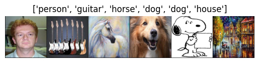
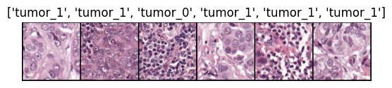

## Installation
From `root` run:
```console
python -m pip install -e .
```

## Data

We ran our experiments on two common domain generalization benchmarks: `PACS` and `Camelyon17`.
For convenience, we provide a utility script, that downloads both datasets and prepares the necessary directory structure.

To use the script, run `download_data.py`:
```console
python download_data.py --all
```
This loads both datasets into the `datasets` directory. To get only of the sets, simply specify either `--download_pacs` 
or `--download_camelyon17`.
The download directory can be changed via the `--datadir` flag.

Alternatively, you can manually load the datasets.

### PACS
The PACS dataset is a benchmark for domain generalization tasks. It consists of images from four domains: Photo, 
Art painting, Cartoon, and Sketch. The dataset includes seven object classes: Dog, Elephant, Giraffe, Guitar, Horse, 
House, and Person, making it suitable for evaluating models across diverse styles and distributions.

<figure>
  
  <figcaption>Fig.2 - Snippet from the PACS dataset. The images are 224x224 pixels and span seven classes over four domains.</figcaption>
</figure>

```tex
@misc{li2017deeperbroaderartierdomain,
      title={Deeper, Broader and Artier Domain Generalization}, 
      author={Da Li and Yongxin Yang and Yi-Zhe Song and Timothy M. Hospedales},
      year={2017},
      eprint={1710.03077},
      archivePrefix={arXiv},
      primaryClass={cs.CV},
      url={https://arxiv.org/abs/1710.03077}, 
}
```

### Camelyon17
The Camelyon17 dataset is a benchmark for evaluating domain generalization in histopathology image analysis. It contains
images from five medical centers in the Netherlands, capturing inter-center variability (i.e. introduced by different
scanners). The dataset is designed for tumor classification tasks and assessing the robustness of machine learning models
in healthcare applications.

We use the patch-based variant of the dataset (Bandhi 2018). The data can be accessed via the 
[`WILDS` ecosystem](https://wilds.stanford.edu/datasets/#camelyon17) or downloaded directly from 
[here](https://camelyon17.grand-challenge.org/Data/).


<figure>
  
  <figcaption>Fig.2 - Snippet from the Camelyon17 dataset. The images show 96x96 pixel patches from different patients lymph nodes from five different medical centers in the Netherlands.</figcaption>
</figure>


```tex
@article{bandi2018detection,
title={From detection of individual metastases to classification of lymph node status at the patient level: the CAMELYON17 challenge},
author={Bandi, Peter and Geessink, Oscar and Manson, Quirine and Van Dijk, Marcory and Balkenhol, Maschenka and Hermsen, Meyke and Bejnordi, Babak Ehteshami and Lee, Byungjae and Paeng, Kyunghyun and Zhong, Aoxiao and others},
journal={IEEE Transactions on Medical Imaging},
year={2018},
publisher={IEEE}
}
```
